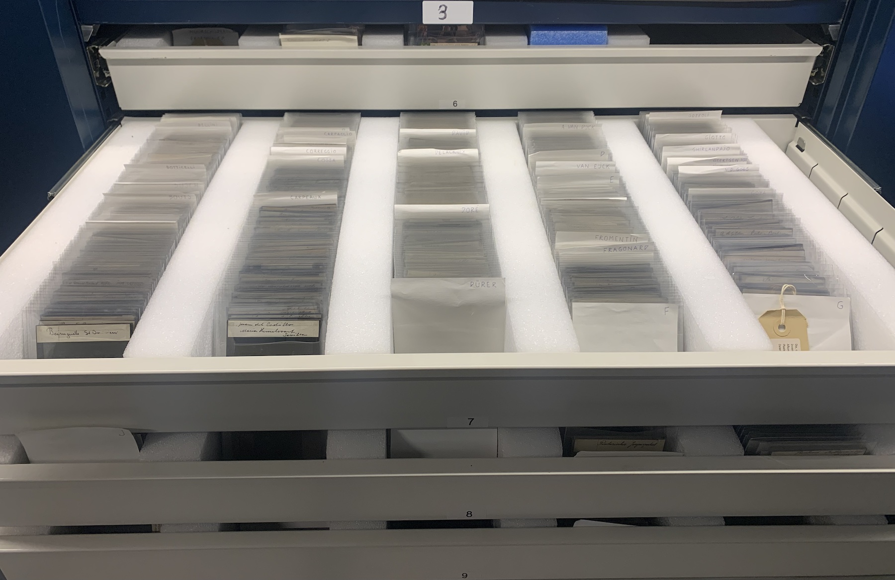
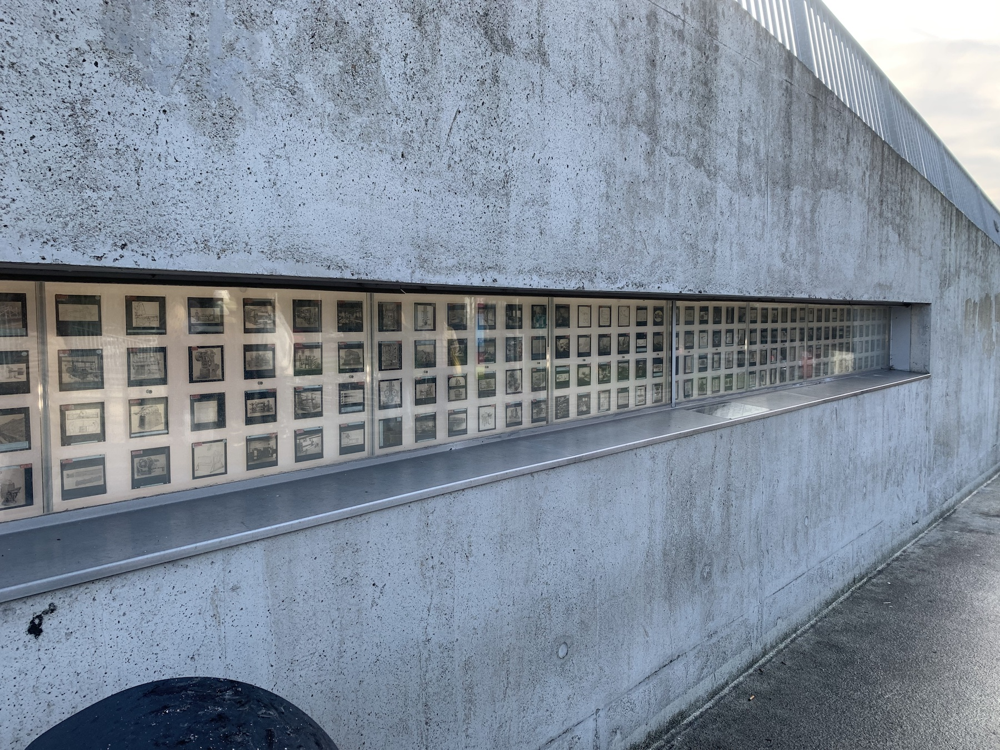
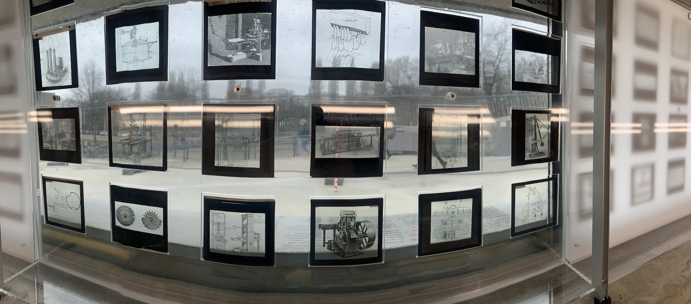
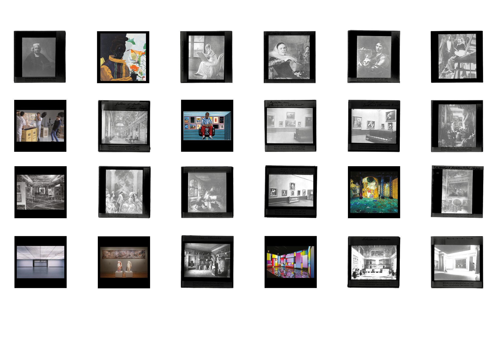
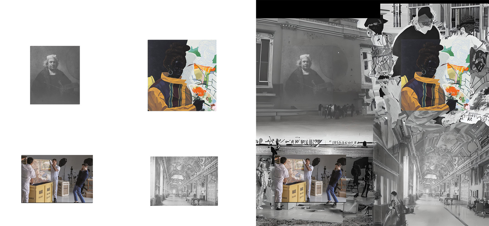
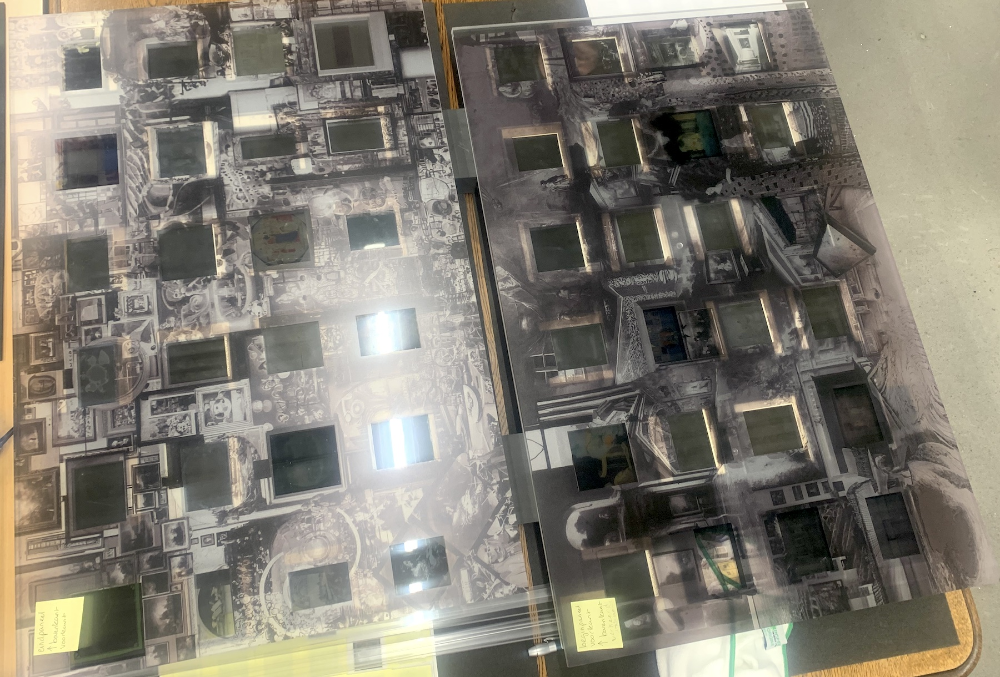
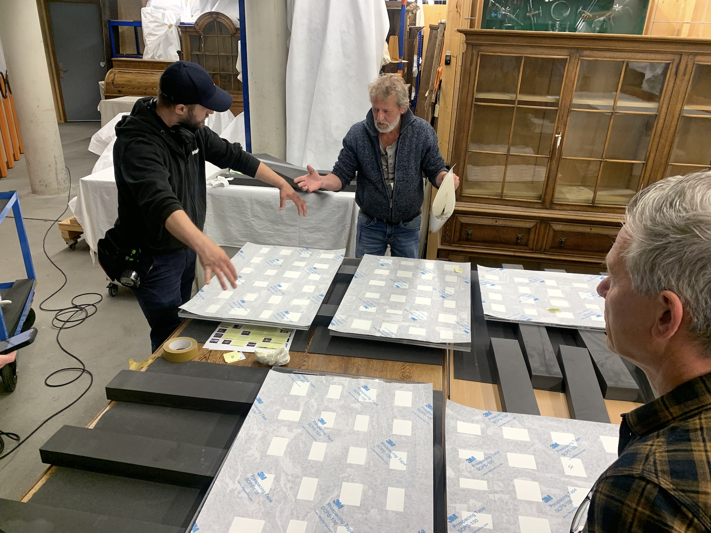
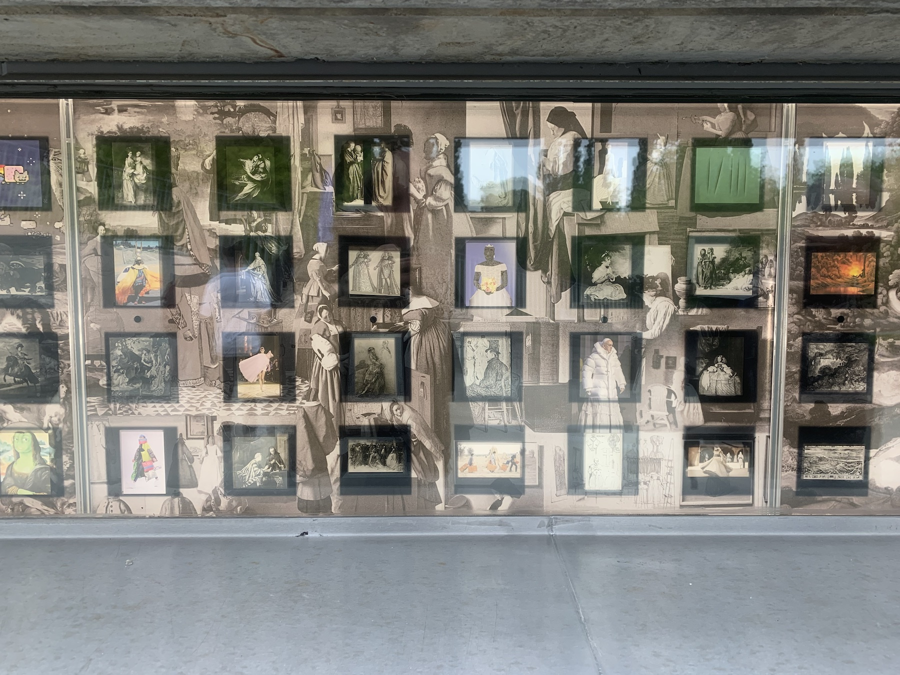
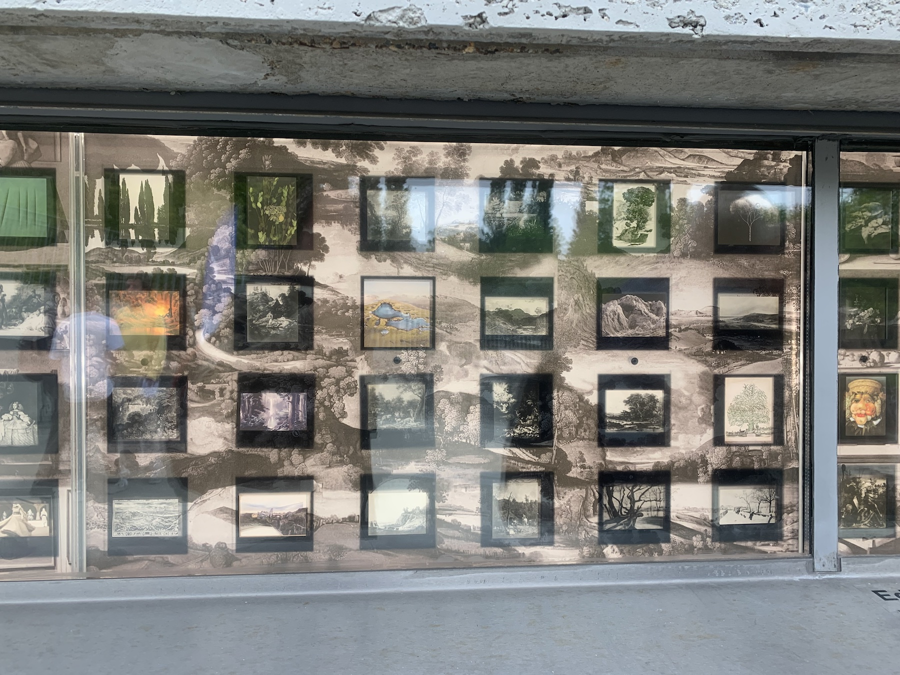
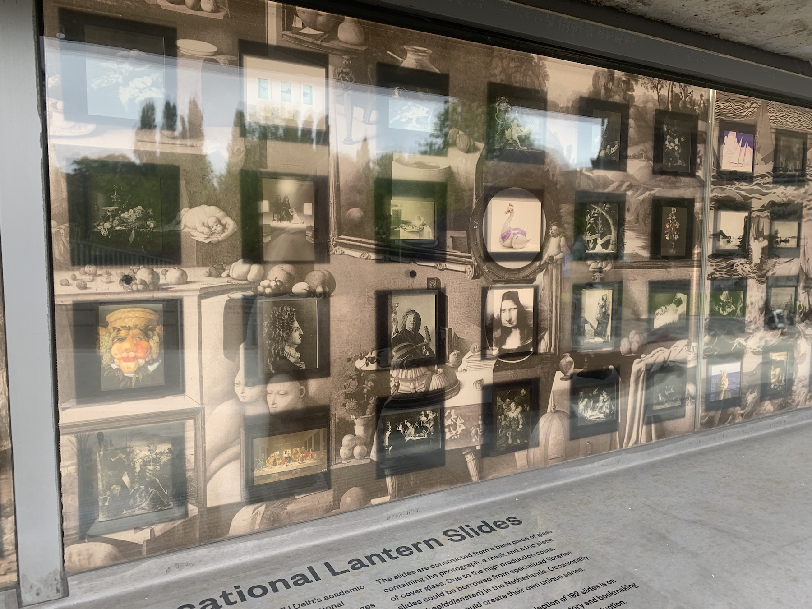

## A Visual Polemic in 8 Acts

We were asked by the TU Delft Library to curate a new glass slides exhibition in the window next to the main entry. This window was originally designed as a viewing stage to take a sneak peak into the TU Delft heritage collection. As the vantage point was not very informative, the Library decided a few years ago to bring the action directly onto the window.

We found an archive of magic lantern slides that had been used in art education, likely at the department of Architecture during the 1920's. A century later, we are still/again using art images in education, but now in a course at Industrial Design Engineering, so that was the first step towards the final work.

Exposing magic lantern slides of artworks is inherently weird: the slides are tiny and meant to be _projected_, and the monochrome photos are no match to contemporary art reproductions (both digital and in print). The 'only' upside is their material connection to the past. Therefore, our first decision was to materialise our own art images collection and mix it with the historical collection.

_Three drawers full of magic lantern glas slides of artworks._

_The magic lantern window with the previous collection._

_A view from the inside._

_The first of the 8 panels digital prototype._

Putting two images next to each other does not only result in two pictures, but also suggests a relation. That is the challenge of any curator creating a collection or exhibition. We had to put 192 magic lantern slides together, and made the second decision: let generative AI hallucinate the pictorial relations. At this moment, Catelijne took the lead and Maarten became more facilitating. He explored various directions and created the first sketch that visualised what was possible:
<!--At this moment, Catelijne took the lead and Maarten became more facilitating. -->

_On the left four images (two original, and two new). On the right the inter image space is filled by an generative AI tool._

From then onward, Catelijne spend 8 consecutive days, 8 hours per with RunwayML performing a task that seemed trivial at the start (let AI figure it out) but turned out wickedly complex. [Here](https://collegerama.tudelft.nl/Mediasite/Channel/ide-symposium-vision-and-depiction-2024/watch/cc9690c3fac748e1919b015943bcd4861d) is a presentation of Catelijne van Middelkoop at [Vision and Depiction 2024](https://visionanddepiction.github.io), describing the process. Tl;dr: generative AI is a wonderful tool, but you still need a human artist prompting, selecting and iterating.

Then the harrowing moments arrived where we had to print the AI  overlay, glue it on perspex panels and pray that they aligned with the actual lanterns slides. Off course they didn't, but in the end they did:

_First overlays arrived and immediately look awesome, although they did not fit..._

_Prints about to be glued to the perspex._

_The final results! Off course better experienced in reality._

[p5.js demo Desktop](https://whenimagesremain.github.io/AVisualPolemicIn8ActsDesktop/)

[p5.js demo Mobile](https://whenimagesremain.github.io/AVisualPolemicIn8ActsMobile/)
